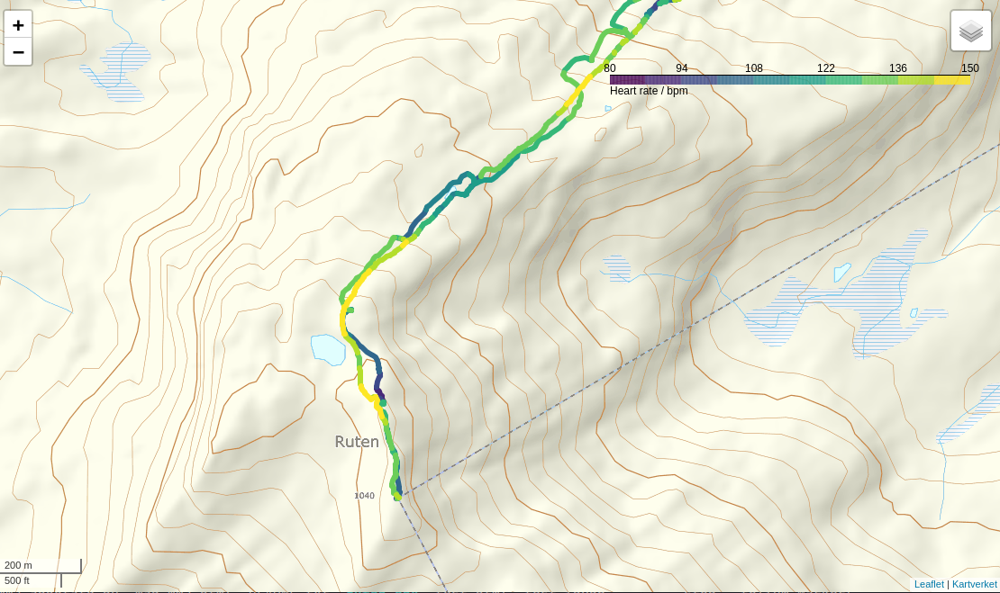

# gpxplotter

[](https://gpxplotter.readthedocs.io/en/latest/?badge=latest)
[](https://mybinder.org/v2/gh/andersle/gpxplotter/main?filepath=examples%2Fjupyter%2F)

**gpxplotter** is a Python package for reading 
[gpx](https://en.wikipedia.org/wiki/GPS_Exchange_Format)
files and creating simple predefined plots using
[matplotlib](http://matplotlib.org/) 
and maps using
[folium](https://python-visualization.github.io/folium/).

Please see
[https://gpxplotter.readthedocs.io/en/latest/](https://gpxplotter.readthedocs.io/en/latest/)
for the latest documentation and the 
[Binder notebooks](https://mybinder.org/v2/gh/andersle/gpxplotter/main?filepath=examples%2Fjupyter%2F) for examples.

## Installation

```
pip install gpxplotter
```

## Examples

Interactive examples can be explored
via [Binder](https://mybinder.org/v2/gh/andersle/gpxplotter/main?filepath=examples%2Fjupyter%2F).


#### Simple example for showing a track in a map, colored by heart rate

```python

from gpxplotter import read_gpx_file, create_folium_map, add_segment_to_map

the_map = create_folium_map()
for track in read_gpx_file('ruten.gpx'):
    for i, segment in enumerate(track['segments']):
        add_segment_to_map(the_map, segment, color_by='hr')

# To display the map in a Jupyter notebook:
the_map
```

[](examples/html/map001.html)

### Further examples

Please see the [gallery in the documentation](https://gpxplotter.readthedocs.io/en/latest/auto_examples_maps/index.html)
for further examples. 
