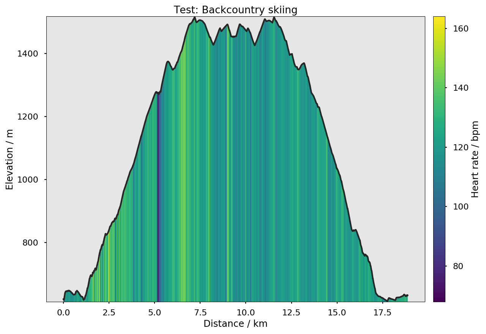

##########
gpxplotter
##########

``gpxplotter`` is a Python package for reading .gpx [1]_ files and make some simple plots.
It uses `matplotlib <http://matplotlib.org/>`_ to create some simple predefined plots and
`mplleaflet <https://github.com/jwass/mplleaflet>`_ for making maps.

Examples
========

Simple example for plotting an elevation profile with heart rate
----------------------------------------------------------------

.. code:: python

   from gpxplotter import read_gpx_file
   from gpxplotter.mplplotting import plot_elevation_hr_multi_dist, save_fig
   from matplotlib import pyplot as plt
   plt.style.use('seaborn-poster')
   
   
   for track in read_gpx_file('test.gpx'):
       for i, segment in enumerate(track['segments']):
           fig = plot_elevation_hr_multi_dist(track, segment)
           save_fig(fig, 'test-{}.png'.format(i))

Simple example for showing a track in a map, colored by heart rate
------------------------------------------------------------------

.. code:: python

   from gpxplotter import read_gpx_file
   from gpxplotter.mplplotting import plot_map, save_map
   
   
   for track in read_gpx_file('test.gpx'):
       for i, segment in enumerate(track['segments']):
           fig = plot_map(track, segment, zcolor='pulse')
           save_map(fig, 'test-{}.html'.format(i))

Installation
============

gpxplot can be installed via pip:

``pip install gpxplot``

Note
====
The intended usage is for displaying heart rate information together with
other information. If the gpx file does not comtain heart rate information,
the source code will have to be modified accordingly.

References
==========

.. [1] https://en.wikipedia.org/wiki/GPS_Exchange_Format
