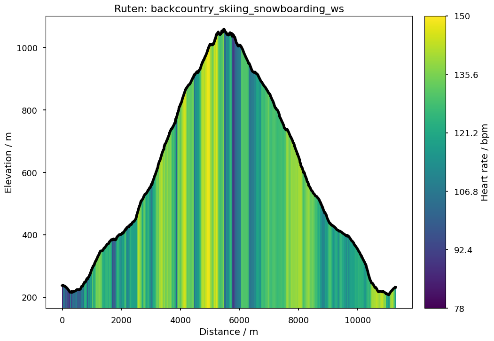

##########
gpxplotter
##########

``gpxplotter`` is a Python package for reading .gpx [1]_ files and make some simple plots.
It uses `matplotlib <http://matplotlib.org/>`_ to create some simple predefined plots and
`folium <https://python-visualization.github.io/folium/>`_ for making maps.

Examples
========

Simple example for plotting an elevation profile with heart rate
----------------------------------------------------------------

.. code:: python

   from gpxplotter import read_gpx_file
   from gpxplotter.mplplotting import plot_filled
   from matplotlib import pyplot as plt
   plt.style.use('seaborn-talk')

   for track in read_gpx_file('ruten.gpx'):
       for i, segment in enumerate(track['segments']):
           fig = plot_filled(track, segment, xvar='distance', yvar='elevation',
                             zvar='hr', lw=4, color='k')
           fig.savefig('plot1', bbox_inches='tight')

Simple example for showing a track in a map, colored by heart rate
------------------------------------------------------------------

.. code:: python

   from gpxplotter import read_gpx_file, create_folium_map, add_segment_to_map

   the_map = create_folium_map()
   for track in read_gpx_file('ruten.gpx'):
       for i, segment in enumerate(track['segments']):
           add_segment_to_map(the_map, segment, color_by='hr')
   the_map.save('test.html')

Installation
============

gpxplotter can be installed via pip:

``pip install gpxplotter``

Note
====
The intended usage is for displaying heart rate information together with
other information (e.g. elevation and time). 

References
==========

.. [1] https://en.wikipedia.org/wiki/GPS_Exchange_Format
